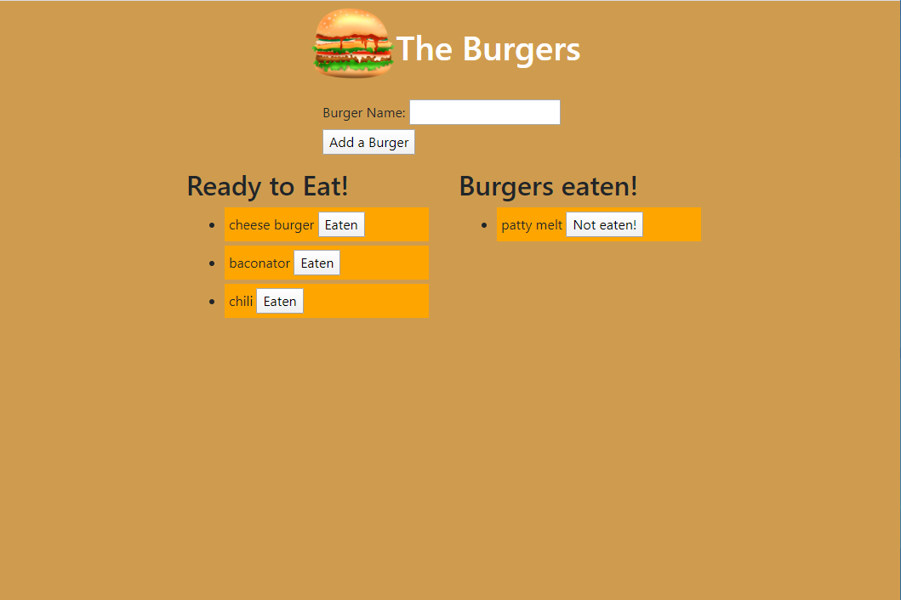

# Burger
https://serene-reaches-44756.herokuapp.com/

## Description

This Node.js to include frontend with MVC structure. This to track favorite burgers, and if they've be eaten or not. 

## Usage
execute by typing:
    node server.js
        or
    npm start

then open the browser to localhost:8080
    alternatively 
you can use the link above under the burger heading. 
## Installation

use the seed.sql and schema.sql file to build your database with the required tables, and columns
    then
  update server.js with "your mysql password" in the password: "" part
  also update "user: root" if needed.

Requires mysql, express, and express-handlebars

use:
    npm install
    to install all the require packages

FAILURE to seed your database, AND change server.js with mysql password, AND npm install
    WILL RESULT IN FAILURE OF THE PROGRAM
